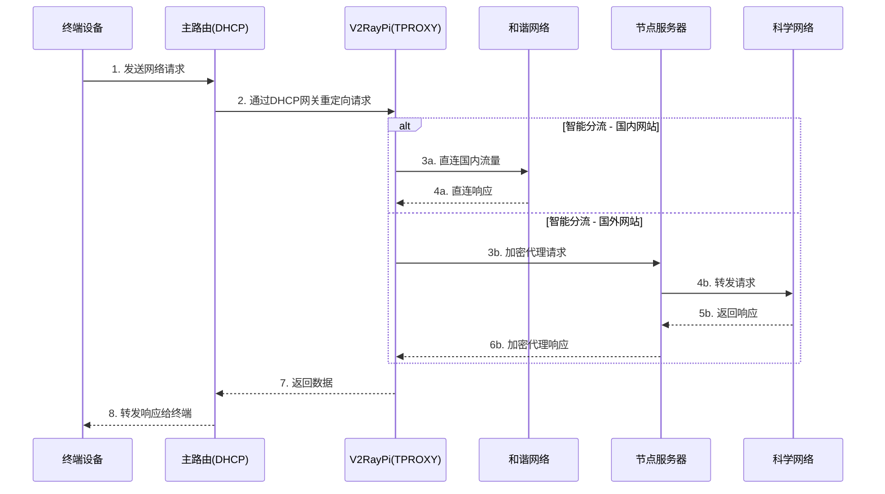

## 目录

- [简介](#简介)
  - [主要特性](#主要特性)
- [平台支持](#平台支持)
  - [操作系统](#操作系统)
  - [硬件平台](#硬件平台)
- [安装指南](#安装指南)
  - [Linux 安装](#linux-安装支持透明代理)
  - [MacOS 安装](#macos-安装)
  - [管理员密码](#管理员密码)
  - [系统更新](#系统更新)
- [功能说明](#功能说明)
  - [协议支持](#协议支持)
  - [节点管理](#节点管理)
  - [DNS 与分流](#dns-与分流)
  - [自定义路由规则](#自定义路由规则)
  - [实时监控](#实时监控)
  - [配置管理](#配置管理)
- [从 Xray 版本升级](#从-xray-版本升级)
- [系统维护](#系统维护)
  - [卸载](#卸载方式)
  - [故障排除](#故障排除)

## 简介

V2RayPi 是一个基于 [mihomo](https://github.com/MetaCubeX/mihomo) 的透明代理系统，专为树莓派和其他单板计算机设计。它可以将设备配置为旁路由，实现整个网络的智能代理。

### 工作原理

V2RayPi 采用旁路由模式工作，下面是数据流的时序图和网络设置说明：


```mermaid
sequenceDiagram
    participant Client as 终端设备
    participant Router as 主路由(DHCP)
    participant V2RayPi as V2RayPi(TPROXY)
    participant DomesticNet as 和谐网络
    participant Server as 节点服务器
    participant ForeignNet as 科学网络

    Client->>Router: 1. 发送网络请求
    Router->>V2RayPi: 2. 通过DHCP网关重定向请求

    alt 智能分流 - 国内网站
        V2RayPi->>DomesticNet: 3a. 直连国内流量
        DomesticNet-->>V2RayPi: 4a. 直连响应
    else 智能分流 - 国外网站
        V2RayPi->>Server: 3b. 加密代理请求
        Server->>ForeignNet: 4b. 转发请求
        ForeignNet-->>Server: 5b. 返回响应
        Server-->>V2RayPi: 6b. 加密代理响应
    end

    V2RayPi-->>Router: 7. 返回数据
    Router-->>Client: 8. 转发响应给终端
```

**网络设置说明：**

1. **主路由配置**
   - 保持原有的上网配置
   - 在 DHCP 设置中将默认网关指向 V2RayPi 的 IP 地址
   - 可选：将 DNS 服务器也设置为 V2RayPi 的 IP 地址，可防止本地 DNS 污染

2. **V2RayPi 配置**
   - 配置与主路由同网段的静态 IP 地址
   - 网关指向主路由 IP
   - DNS 服务器使用主路由 IP
   - 终端设备：无需任何设置，通过 DHCP 自动配置

### 主要特性
- **单一内核**：全部协议由 mihomo 原生承载，没有 sidecar 进程、没有本机 SOCKS 串联
- **透明代理**：终端设备无需任何设置，只需连接到主路由即可
- **多种代理模式**：支持直连、智能分流、全局代理
- **多协议支持**：VMess、VLESS（含 Reality）、Trojan、Shadowsocks、AnyTLS、Hysteria2、Mieru、TUIC、WireGuard 等
- **Clash 订阅**：订阅节点原样透传给内核，不做字段转换，因此不会丢失协议参数
- **节点收藏**：支持收藏常用节点，快速切换
- **实时监控**：实时显示网络速度和系统性能图表；Linux 旁路由使用客户端侧 iptables 计数，避免将代理上游流量与客户端上下行混合
- **配置管理**：支持配置备份和恢复，便于迁移和灾难恢复
- **自动化管理**：自动处理订阅更新和策略配置
- **一键更新**：内置 mihomo 及系统更新功能
- **跨平台支持**：支持多种硬件平台和操作系统
- **中英双语**：首次访问跟随浏览器语言，可在顶栏随时切换并记住选择
- **简单易用**：图形化管理界面，操作直观

原理参考：[透明代理(TPROXY)](https://guide.v2fly.org/app/tproxy.html)、[mihomo 文档](https://wiki.metacubex.one/)

TG讨论组：[https://t.me/v2raypi](https://t.me/v2raypi)

## 平台支持

### 操作系统
- MacOS
- Debian
- Armbian
- Raspberry Pi OS
- Ubuntu

### 硬件平台
- [Raspberry Pi 4B](https://www.raspberrypi.com/products/raspberry-pi-4-model-b)
- [ZeroPi](https://wiki.friendlyelec.com/wiki/index.php/ZeroPi)
- [NanoPi NEO 2](https://wiki.friendlyelec.com/wiki/index.php/NanoPi_NEO2)
- [NanoPi NEO 3](https://wiki.friendlyelec.com/wiki/index.php/NanoPi_NEO3)
- [Orange Pi Zero2](http://www.orangepi.cn/Orange%20Pi%20Zero2/index_cn.html)
- MacBook 及其他 MacOS 设备
- 其他 ARM、x86、x64 设备（PC/软路由/电视盒子/开发板/虚拟机）

安装脚本支持的 CPU 架构：x86_64、arm64、armv7、armv6、riscv64（Linux），以及 Intel 与 Apple Silicon（macOS）。

## 安装指南

### Linux 安装（支持透明代理）
支持的发行版：Debian / Armbian / Ubuntu / CentOS

```bash
# 1. 安装系统
sudo su root -
cd /usr/local
git clone https://github.com/twotreesus/V2RayPi.git
cd V2RayPi/script
./install.sh

# 2. 启动服务
sudo supervisorctl restart v2raypi

# 3. 配置静态 IP 和网关，这里假设主路由 IP 是 192.168.66.1

# 由于系统版本繁多，推荐使用系统自带的配置工具：
# - Raspberry Pi OS: 使用 raspi-config
# - Orange Pi: 使用 orangepi-config
# - Armbian: 使用 armbian-config
# - 其他系统: 可手动配置

# 手动配置示例（使用 NetworkManager）：

# 查看网络连接列表
$ nmcli connection show

# 创建新的静态 IP 连接（假设网络接口为 eth0）
$ sudo nmcli connection add con-name "static-eth0" ifname eth0 type ethernet ip4 192.168.66.200/24 gw4 192.168.66.1

# 设置 DNS
$ sudo nmcli connection modify static-eth0 ipv4.dns "192.168.66.1"

# 启用连接
$ sudo nmcli connection up static-eth0

# 设置为开机自动连接
$ sudo nmcli connection modify static-eth0 connection.autoconnect yes

# 4. 重启设备
sudo reboot
```

配置主路由：
1. 进入主路由器的 DHCP 设置
2. 将默认网关设置为 V2RayPi 的 IP 地址（如上述配置中的 192.168.66.200）
3. 为防止 DNS 劫持，将 DNS 服务器设置为 V2RayPi 的 IP 地址

完成配置后，浏览器输入 V2RayPi 的地址（如 `192.168.66.200:1086`）即可访问管理面板

> 安装脚本首次安装时**不会**启用 TPROXY iptables 规则，以避免尚未配置可用节点时旁路由断网。首次成功应用节点后，V2RayPi 会自动配置规则并启用 `mihomo_iptable.service`；之后每次应用节点都会检查该服务，重复安装也会保留已启用状态。

### MacOS 安装
> 注意：MacOS 版本不支持透明代理功能

```bash
# 1. 安装 Homebrew
ruby -e "$(curl -fsSL https://raw.githubusercontent.com/Homebrew/install/master/install)"

# 2. 克隆项目
cd ~/Documents/
git clone https://github.com/twotreesus/V2RayPi.git
cd V2RayPi

# 3. 安装依赖
./script/install_osx.sh

# 4. 启动服务
python3 app.py
```

安装完成后：
1. 访问管理面板：浏览器输入 `127.0.0.1:1086`
2. 配置代理：浏览器设置 SOCKS5 代理为 `127.0.0.1:1080`（Chrome 浏览器推荐使用 SwitchyOmega 插件）

### 管理员密码
系统首次安装后，默认管理员密码为 `admin`。出于安全考虑，强烈建议在首次登录后立即修改密码：
1. 在管理面板中点击「系统维护」选项卡
2. 在「密码管理」区域输入新密码
3. 点击「更新」按钮完成修改

注意：密码修改后将立即生效，请妥善保管新密码。如果忘记密码，可以通过以下方式重置：
```bash
# 进入项目目录
cd /usr/local/V2RayPi

# 删除密码哈希，重置为默认密码 admin
python3 -c "import json; config = json.load(open('config/app_config.json')); config.pop('password_hash', None); json.dump(config, open('config/app_config.json', 'w'), indent=4)"

# 重启服务
sudo supervisorctl restart v2raypi
```

### 系统更新
系统页面提供了一键更新功能：

**更新 V2RayPi**
1. 在系统页面查看最近更新记录，点击「检查更新」
2. 有新版本时点击「更新并重启」；更新过程中代理服务不中断

**更新 mihomo**
1. 在系统页面 mihomo 区块点击「查询」获取最新版本。
2. 版本不一致时点击「升级」即可，升级完成后内核会自动重启。

也可以在命令行安装或更新 mihomo：
```bash
# Linux 通常需要 sudo；macOS 如 /usr/local/bin 无写入权限也需要 sudo
sudo ./script/update_mihomo.sh update

# 查看已安装版本
./script/update_mihomo.sh version
```

安装脚本会从 GitHub 官方 release 下载对应架构的二进制文件。若该 release 发布了校验值则会验证 SHA-256，否则会明确提示未做校验，并通过「解压成功 + 新二进制可运行」两道检查兜底。

手动更新方式（可选）：
```bash
# 进入项目目录
cd V2RayPi

# 拉取最新代码
git pull

# 重启服务
sudo supervisorctl restart v2raypi
```

## 功能说明

### 协议支持

全部协议由 mihomo 原生承载，无需 sidecar：

| 协议 | 说明 |
|------|------|
| VMess | V2Ray 原生协议 |
| VLESS | 轻量级协议，支持 Reality 与 XTLS Vision |
| Trojan | 伪装成 HTTPS 流量 |
| Shadowsocks / ShadowsocksR | 经典代理协议 |
| AnyTLS | TLS 伪装协议 |
| Hysteria / Hysteria2 | 基于 QUIC 的代理协议，支持端口跳跃和混淆 |
| Mieru | 抗审查协议，支持 TCP/UDP 传输与多路复用等级 |
| TUIC | 基于 QUIC 的代理协议 |
| Snell / WireGuard / SSH / SOCKS5 / HTTP | 其他 mihomo 支持的出站 |

订阅中出现上表之外的类型时会被跳过，并在服务日志中记录跳过数量。

### 节点管理

- **订阅管理**：仅支持 Clash YAML 格式订阅。节点配置原样保存并交给 mihomo，因此 `reality-opts`、`ws-opts`、`grpc-opts`、`smux` 等参数不会在导入过程中丢失
- **节点收藏**：收藏常用节点，在收藏列表中快速切换
- **节点分享与导入**：节点行可复制协议分享 URL 或显示二维码；也可手动添加 VMess、VLESS、Shadowsocks、Trojan、Hysteria2、AnyTLS 或 Mieru URL 到收藏

### DNS 与分流

- mihomo 的 DNS 服务监听 `0.0.0.0:1053`，`config_iptable.sh` 会把局域网和本机的 53 端口查询重定向到该端口
- 采用 `redir-host` 模式而非 fake-ip：旁路由无法保证所有客户端都使用本机作为 DNS（走 DoH/DoT 的应用会完全绕过），fake-ip 在这种情况下会静默失效，而 redir-host 会退化为按 IP 分流
- 同时开启域名嗅探（SNI / HTTP Host），让绕过本机 DNS 的连接仍能命中域名类规则
- 「高级设置」中的远程 DNS 查询会通过代理发出，避免明文查询被污染；节点服务器域名、订阅域名、`geosite:cn`（智能分流模式）以及用户配置的直连域名策略均使用本地 DNS 解析

### 自定义路由规则

域名匹配支持的写法：

| 写法 | 含义 |
|------|------|
| `example.com` | 包含匹配，`sina.com` 可匹配 `sina.com.cn`、`www.sina.com` |
| `keyword:ads` | 同上，写法更明确 |
| `domain:example.com` | 后缀匹配（推荐），匹配该域名及其子域名 |
| `full:example.com` | 完整匹配 |
| `regexp:^ad.*` | 正则匹配 |
| `geosite:netflix` | 预定义域名列表，取值来自 `geosite.dat` |

IP 匹配支持 `1.2.3.4`、`10.0.0.0/8`、`geoip:cn`、`geoip:!cn`。私有地址已由内置规则直连，无需另行添加。

单条规则写法无法识别时只跳过该条，不影响其余规则和内核启动，跳过原因会记录在服务日志中。

### 实时监控

- **网络速度**：实时显示上传/下载速度图表
- **系统性能**：CPU、内存使用率监控
- **状态栏**：顶部状态栏显示当前协议、运行状态等信息

### 配置管理

- **备份配置**：一键导出所有配置（订阅、节点、系统设置等），下载为 zip 文件
- **恢复配置**：从备份文件恢复，便于迁移或灾难恢复

## 从 Xray 版本升级

本版本用 mihomo 替换了原先的 xray-core + sing-box + mieru 三内核结构，有以下行为变更：

1. **需要重新更新一次订阅。** 节点模型已经改变，旧的节点数据无法交给 mihomo，启动时会被自动丢弃并在服务日志中记录数量。订阅地址本身会保留，因此升级后在「订阅」页点一次「全部更新」即可恢复节点列表。
2. **高级设置会重置为默认值。** 配置文件由 `config/v2ray_user_config.json` 换成了 `config/mihomo_user_config.json`，不做迁移。升级前建议先在「系统维护」导出一份旧配置留档，以便对照着重新填写 DNS、自定义路由规则等设置。
3. **订阅只支持 Clash YAML 格式。** v2rayN base64 订阅不再支持；单个节点仍可通过 VMess、VLESS、Shadowsocks、Trojan、Hysteria2、AnyTLS 或 Mieru 分享 URL 手动添加到收藏。
4. **BitTorrent 直连规则不再存在。** mihomo 没有协议嗅探类规则，无法忠实翻译原先的 `protocol: bittorrent` 规则。如需 BT 直连，可针对 tracker 域名添加自定义路由规则。
5. **自定义路由规则不支持 `ext:file:tag` 写法**，请改用 `geosite:` / `geoip:`。
6. **日志由「访问日志 + 错误日志」两栏合并为单栏**，mihomo 只有一个日志流。
7. **iptables 链名变更**（`V2RAY` → `MIHOMO`，`V2RAY_MASK` → `MIHOMO_MASK`）。`config_iptable.sh` 会自动清理旧链，无需手工处理。流量计数链 `V2RAYPI_TRAFFIC_UP/DOWN` 保持不变。

原地升级后建议执行一次 `sudo reboot`，确保 iptables 与 systemd 状态干净。

## 卸载方式

```
sudo ./script/remove.sh
sudo reboot
```

`remove.sh` 会同时清理旧版本遗留的 xray、sing-box、mieru 二进制、服务文件以及 `mieru` 系统用户，因此从旧版本升级过来的设备也能彻底卸载干净。

## 故障排除

### 维护操作
```bash
# 检查 V2RayPi 服务状态
sudo supervisorctl status v2raypi

# 查看 V2RayPi 服务日志
sudo supervisorctl tail -f v2raypi

# 重启 V2RayPi 服务
sudo supervisorctl restart v2raypi

# 手动强制更新 V2RayPi 服务
sudo git reset --hard && sudo git pull && sudo supervisorctl restart v2raypi

# 查看 mihomo 状态与日志
sudo systemctl status mihomo --no-pager
tail -f /var/log/mihomo/mihomo.log
sudo journalctl -u mihomo -o cat -f

# 校验当前生成的配置
mihomo -t -d /etc/mihomo -f /etc/mihomo/config.yaml

# 查看生成的配置
cat /etc/mihomo/config.yaml

# 查看 TPROXY 规则服务是否会在重启后自动恢复
sudo systemctl is-enabled mihomo_iptable.service
sudo systemctl status mihomo_iptable.service --no-pager
```

### 常见问题

1. 网络无法访问
   - 检查主路由的 DHCP 网关是否设置为 V2RayPi 的 IP
   - 检查 V2RayPi 旁路由的网络设置是否正确（IP、网关、DNS），自身为静态 IP，网关和 DNS 应该为主路由的 IP
   - 检查 mihomo 是否运行：`sudo systemctl status mihomo`
   - 尝试应用其他订阅节点，并查看 mihomo 日志确认连接错误

2. 管理面板无法访问
   - 检查 V2RayPi 服务是否运行
   - 重启服务
   - 查看日志定位问题

3. 节点更新失败
   - 检查订阅地址是否可访问
   - 确认订阅是 Clash YAML 格式（内容包含 `proxies:`），base64 格式订阅不再支持
   - 查看服务日志，非 Clash 内容与被跳过的节点都会记录原因

4. 系统更新失败
   - 检查网络连接
   - 手动更新 V2RayPi

5. 应用节点失败
   - V2RayPi 在写入配置前会用 `mihomo -t` 预检，配置被拒绝时不会覆盖正在运行的配置
   - 查看 V2RayPi 服务日志，其中会打印 mihomo 的具体报错

6. 透明代理不生效
   - 确认系统是否支持 TPROXY（MacOS 不支持）
   - 检查 iptables 规则：`sudo iptables -t mangle -L MIHOMO -n -v`
   - 检查 DNS 重定向：`sudo iptables -t nat -L MIHOMO_DNS -n -v`
   - 重启服务并检查日志

7. DNS 解析异常
   - 确认高级设置中的远程 DNS 使用 IP 地址；默认远程 DNS 为 `8.8.8.8`
   - 确认 53 端口没有被系统服务占用：`ss -lunp | grep ':53 '`、`systemctl is-active systemd-resolved`
   - 直接向 mihomo 的 DNS 服务发起查询验证：`dig @127.0.0.1 -p 1053 www.google.com`
   - 使用 `sudo tcpdump -ni any 'port 53'` 观察 DNS 请求是否进入网关

8. 上传/下载速度显示异常
   - Linux 旁路由的监控使用 `V2RAYPI_TRAFFIC_UP` 和 `V2RAYPI_TRAFFIC_DOWN` 两个 mangle 计数链：上传统计客户端进入旁路由的流量，下载统计转发或代理输出到客户端的流量，不再直接使用主机所有网卡的合计值。
   - 检查计数器是否存在：`sudo iptables -t mangle -L V2RAYPI_TRAFFIC_UP -v -x -n` 和 `sudo iptables -t mangle -L V2RAYPI_TRAFFIC_DOWN -v -x -n`。
   - 脚本会按默认路由接口自动识别 LAN 网段；多网卡或特殊拓扑可在执行规则脚本前设置 `V2RAYPI_LAN_CIDR`，例如 `V2RAYPI_LAN_CIDR=10.0.0.0/24 sudo -E ./script/config_iptable.sh`。
   - 如果规则链不存在，页面会暂时显示系统网卡计数器作为兼容回退，并在接口返回的 `network.source` 中标记为 `system`。

9. 内存占用偏高
   - `geodata-loader` 已设为 `memconservative`，适配小内存设备
   - 用 `ps -o rss= -C mihomo` 查看实际占用；512MB 设备建议关闭不必要的服务

### 其他问题
如果遇到其他问题，可以：
1. 查看详细日志定位问题
2. 在 [GitHub Issues](https://github.com/twotreesus/V2RayPi/issues) 中搜索或提交问题
3. 加入 [TG 讨论组](https://t.me/v2raypi) 寻求帮助
